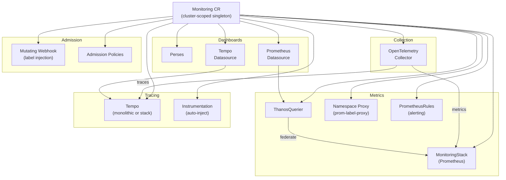

# ODH Observability Operator

A standalone Kubernetes operator that deploys and manages the observability stack for [Open Data Hub](https://opendatahub.io/) and Red Hat OpenShift AI (RHOAI). It reconciles a single `Monitoring` custom resource into a full metrics, tracing, and dashboarding pipeline.

## Architecture



The operator watches the `Monitoring` CR and conditionally deploys each sub-system based on what is configured in the spec. Features whose prerequisite CRDs are not installed on the cluster are skipped gracefully and reported in status conditions.

## Prerequisites

The operator requires the following CRDs to be available on the cluster (installed by their respective operators):

| Operator | CRDs Used | Required For |
|----------|-----------|--------------|
| [Cluster Observability Operator (COO)](https://github.com/rhobs/cluster-observability-operator) | `MonitoringStack`, `ThanosQuerier` | Metrics |
| [Tempo Operator](https://github.com/grafana/tempo-operator) | `TempoMonolithic`, `TempoStack` | Tracing |
| [OpenTelemetry Operator](https://github.com/open-telemetry/opentelemetry-operator) | `OpenTelemetryCollector`, `Instrumentation` | Collection |
| [cert-manager](https://cert-manager.io/) | `Certificate`, `Issuer` | Webhook TLS |
| [Perses Operator](https://github.com/perses/perses-operator) | `Perses`, `PersesDashboard`, `PersesDatasource` | Dashboards |

Only cert-manager is strictly required (for the admission webhook). All other operators are optional -- the controller detects their presence at runtime and deploys only what is available.

## Quick Start

```bash
# Install via Helm
helm install odh-observability charts/odh-observability \
  --namespace opendatahub-operator-system \
  --create-namespace

# Create a minimal Monitoring CR (metrics only)
kubectl apply -f config/samples/monitoring_minimal.yaml
```

## Configuration

The `Monitoring` CR is cluster-scoped and singleton (name must be `default-monitoring`).

### Spec Reference

| Field | Type | Default | Description |
|-------|------|---------|-------------|
| `managementState` | `Managed` \| `Removed` | `Managed` | Controls whether the operator manages or removes all resources. |
| `namespace` | `string` | `opendatahub` | Target namespace for monitoring resources. Immutable after creation. |
| `metrics` | object | *nil* | Configures metrics collection via MonitoringStack. |
| `metrics.storage.size` | `Quantity` | - | PVC storage size (e.g. `5Gi`). |
| `metrics.storage.retention` | `string` | - | Metrics retention period (e.g. `15d`). |
| `metrics.replicas` | `int32` | `0` | MonitoringStack replicas. Requires `storage` when non-zero. |
| `metrics.exporters` | `map[string]object` | - | Custom OTel Collector exporter configs. Max 10. Reserved names: `prometheus`, `otlp/tempo`. |
| `traces` | object | *nil* | Configures distributed tracing via Tempo. |
| `traces.storage.backend` | `pv` \| `s3` \| `gcs` | - | **Required** when traces is set. Storage backend type. |
| `traces.storage.size` | `string` | - | Storage size (PV backend only). |
| `traces.storage.secret` | `string` | - | Secret with credentials (required for S3/GCS). |
| `traces.storage.retention` | `Duration` | - | Trace data retention (e.g. `48h`). |
| `traces.sampleRatio` | `string` | - | Sampling rate `0.0`-`1.0`. |
| `traces.tls` | object | - | TLS config for Tempo gRPC connections. |
| `traces.exporters` | `map[string]object` | - | Custom trace exporter configs. |
| `alerting` | object | *nil* | Enables Prometheus alerting rules. Requires `metrics.storage`. |
| `collectorReplicas` | `int32` | `0` | OTel Collector replicas (auto-scaled: 1 single-node, 2 multi-node). Requires metrics or traces. |

### Example CRs

See [`config/samples/`](config/samples/) for complete examples:
- **Minimal** -- metrics only with storage defaults
- **Metrics + Traces** -- metrics with PV-backed tracing
- **Full** -- all features enabled including S3 tracing, alerting, and custom exporters

### Status Conditions

The operator reports granular status via conditions on the `Monitoring` CR:

| Condition | Meaning |
|-----------|---------|
| `Ready` | All configured features are healthy. |
| `ProvisioningSucceeded` | Manifests were applied successfully. |
| `Degraded` | Partially functional (e.g. main service up but a sub-component failing). |
| `MonitoringStackAvailable` | Prometheus MonitoringStack is deployed and healthy. |
| `ThanosQuerierAvailable` | ThanosQuerier federation layer is running. |
| `TempoAvailable` | Tempo tracing backend is deployed. |
| `OpenTelemetryCollectorAvailable` | OTel Collector pipeline is running. |
| `PersesAvailable` | Perses dashboard server is deployed. |
| `WebhookAvailable` | Mutating admission webhook is serving. |

## Development

### Prerequisites

- Go 1.25+
- kubectl
- Helm 3
- Access to a Kubernetes/OpenShift cluster (for E2E testing)
- [controller-gen](https://book.kubebuilder.io/reference/controller-gen) (installed automatically by `make`)

### Build and Test

```bash
# Run unit tests
make test

# Run unit tests only (skip codegen)
make unit-test

# Build the operator binary
make build

# Run locally against a cluster (requires KUBECONFIG)
POD_NAMESPACE=opendatahub make run

# Build container image
make docker-build IMG=my-registry/odh-observability:dev

# Lint Helm chart
make helm-lint
```

### Deploy to a Cluster

```bash
# Deploy via Helm
make deploy IMG=my-registry/odh-observability:dev NAMESPACE=my-namespace

# Remove
make undeploy
```

### Code Generation

After modifying API types in `api/v1alpha1/`:

```bash
# Regenerate CRD manifests, RBAC, webhook configs, and DeepCopy
make manifests generate

# Sync CRDs to the Helm chart
make helm-update-crds
```

## Relationship to opendatahub-operator

This operator is a modularized extraction of the monitoring service from the [opendatahub-operator](https://github.com/opendatahub-io/opendatahub-operator). It is designed to run as a **standalone, self-sufficient operator** following the [ODH module architecture](https://github.com/opendatahub-io/opendatahub-operator/blob/main/docs/DESIGN.md).

When deployed standalone, the operator reconciles the `Monitoring` CR directly. When running as part of the ODH platform, the opendatahub-operator acts as an orchestrator: it deploys this operator via Helm, creates the `Monitoring` CR based on the `DataScienceCluster` configuration, and aggregates status back to the DSC.

## License

Apache License 2.0. See [LICENSE](LICENSE).
